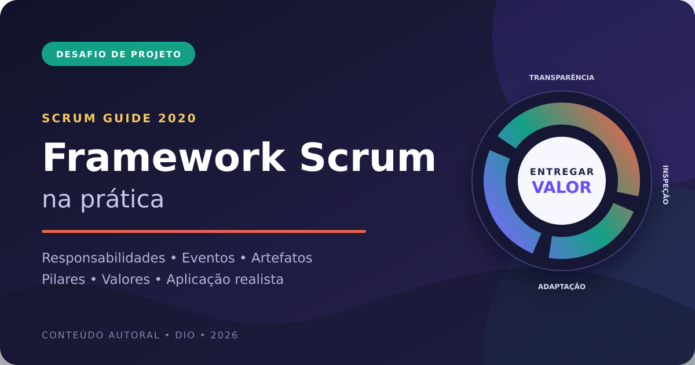
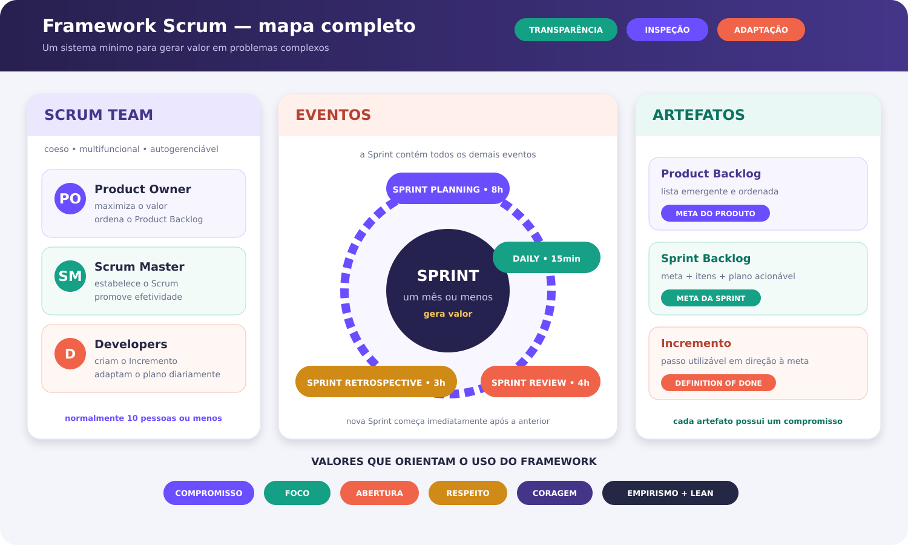
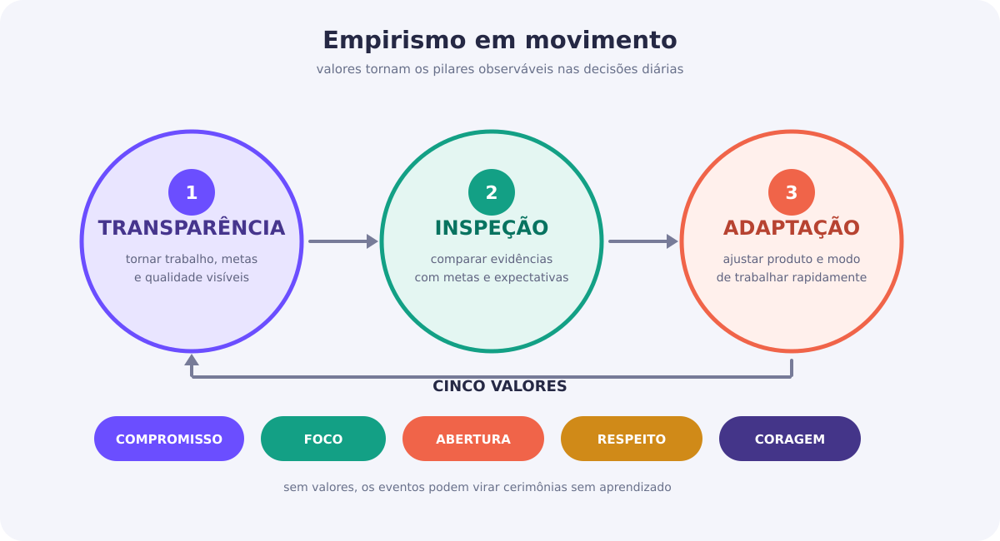
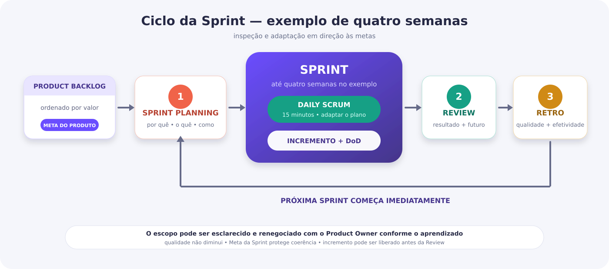

<div align="center">



# Framework Scrum na Prática

### Um mapa autoral, visual e aplicado do Scrum Guide 2020

[](https://scrumguides.org/)
[](docs/REFERENCIAS.md)
[](#originalidade)
[](#)

Projeto desenvolvido para o desafio **“Completando o Framework Scrum”**, da DIO.

</div>

## Sobre o projeto

Este repositório transforma os fundamentos do Scrum em um material de estudo visual, navegável e aplicado. Em vez de apenas preencher um template, o projeto explica **como responsabilidades, eventos, artefatos, compromissos, pilares e valores funcionam como um sistema**.

A entrega possui três camadas:

1. **mapa conceitual:** todos os elementos oficiais do Scrum Guide 2020;
2. **classificação crítica:** o que pertence ao Scrum, o que é opcional e o que é uma pegadinha;
3. **aplicação prática:** uma Sprint de quatro semanas para o produto fictício EcoCiclo.

> **Ideia central:** Scrum não é uma sequência de reuniões. É um sistema mínimo de transparência, inspeção e adaptação orientado por metas e qualidade.

## Entrega principal

- 🌐 [Abrir o guia interativo](index.html)
- 📘 [Ler o guia completo](docs/GUIA_COMPLETO.md)
- 🧩 [Ver a classificação dos cards](docs/CLASSIFICACAO_DOS_CARDS.md)
- ♻️ [Acompanhar a aplicação prática EcoCiclo](docs/APLICACAO_PRATICA.md)
- 📄 [Baixar versões em PDF e DOCX](entrega/)

## Framework em uma visão



### Scrum Team

| Responsabilidade | Foco |
|---|---|
| Product Owner | maximizar valor e gerir efetivamente o Product Backlog |
| Scrum Master | estabelecer Scrum e promover a efetividade do time |
| Developers | criar um Incremento utilizável a cada Sprint |

### Eventos

| Evento | Timebox máximo para Sprint de um mês |
|---|---:|
| Sprint | um mês ou menos |
| Sprint Planning | 8 horas |
| Daily Scrum | 15 minutos |
| Sprint Review | 4 horas |
| Sprint Retrospective | 3 horas |

### Artefatos e compromissos

| Artefato | Compromisso |
|---|---|
| Product Backlog | Meta do Produto |
| Sprint Backlog | Meta da Sprint |
| Incremento | Definition of Done |

## Pilares e valores



- **Pilares:** transparência, inspeção e adaptação.
- **Valores:** compromisso, foco, abertura, respeito e coragem.

A explicação comportamental está em [Pilares e Valores](docs/PILARES_E_VALORES.md).

## Ciclo da Sprint



A Sprint contém os demais eventos e começa novamente sem intervalo obrigatório. Incrementos podem ser liberados sempre que estiverem utilizáveis e atenderem à Definition of Done; a Sprint Review não é um portão de entrega.

## Aplicação autoral: EcoCiclo

O **EcoCiclo** é uma plataforma fictícia para localizar pontos de reciclagem e consultar materiais aceitos.

**Meta do Produto:** tornar o descarte responsável mais simples, permitindo que moradores encontrem uma opção adequada em até dois minutos.

**Meta da primeira Sprint:** permitir a busca de um ecoponto confiável por CEP e material aceito, com as informações essenciais para o deslocamento.

O exemplo contém:

- Product Backlog ordenado;
- Sprint Goal e itens selecionados;
- plano inicial dos Developers;
- Definition of Done;
- calendário de eventos;
- cenário realista de inspeção e adaptação.

[Consultar aplicação completa](docs/APLICACAO_PRATICA.md).

## O que não deve ser confundido com Scrum

- Project Manager não é uma responsabilidade obrigatória do framework;
- Sprint 0 não existe na definição oficial;
- refinamento é atividade, não evento formal;
- user stories, story points e planning poker são opcionais;
- quadro Kanban não é artefato Scrum;
- Daily Scrum não é reunião de status para o chefe;
- release não depende da Sprint Review;
- trabalho abaixo da Definition of Done não é Incremento.

Veja a análise completa em [Classificação dos Cards](docs/CLASSIFICACAO_DOS_CARDS.md) e [Antipadrões](docs/ANTI_PADROES.md).

## Material de revisão

- [quiz com 15 perguntas e gabarito](docs/QUIZ.md);
- [pilares e valores em comportamentos observáveis](docs/PILARES_E_VALORES.md);
- [antipadrões e respectivas correções](docs/ANTI_PADROES.md);
- [referências e critérios de uso](docs/REFERENCIAS.md).

## Estrutura

```text
scrum-framework-na-pratica/
├── assets/
│   ├── capa.svg
│   ├── capa-documento.png
│   ├── ciclo-sprint.svg
│   ├── mapa-framework.svg
│   └── pilares-valores.svg
├── docs/
│   ├── ANTI_PADROES.md
│   ├── APLICACAO_PRATICA.md
│   ├── CLASSIFICACAO_DOS_CARDS.md
│   ├── GUIA_COMPLETO.md
│   ├── PILARES_E_VALORES.md
│   ├── QUIZ.md
│   └── REFERENCIAS.md
├── entrega/
│   ├── Guia_Framework_Scrum.docx
│   └── Guia_Framework_Scrum.pdf
├── scripts/
│   ├── generate_deliverables.py
│   └── validate_project.py
├── tests/
│   └── test_project.py
├── CONTRIBUTING.md
├── ENTREGA_DIO.md
├── index.html
├── LICENSE
├── Makefile
├── README.md
└── requirements.txt
```

## Execução local

O guia interativo não exige instalação. Abra `index.html` diretamente ou execute:

```bash
python -m http.server 8000
```

Acesse `http://localhost:8000`.

Para regenerar PDF e DOCX e executar todas as verificações:

```bash
python -m venv .venv
source .venv/bin/activate          # Linux ou macOS
# Windows PowerShell: .\.venv\Scripts\Activate.ps1
# Windows CMD: .venv\Scripts\activate.bat
python -m pip install -r requirements.txt
python scripts/generate_deliverables.py
python scripts/validate_project.py
python -m unittest discover -s tests -v
```

O projeto utiliza apenas bibliotecas gratuitas e não depende de API, credenciais ou serviço pago.

## Originalidade

Todo o conteúdo foi produzido especificamente para esta entrega. O projeto **não copia os slides, o quadro Miro ou repositórios de outros participantes**. A identidade visual, a organização, os diagramas e o caso EcoCiclo são autorais. Conceitos normativos estão vinculados ao Scrum Guide 2020.

## Autor

Desenvolvido por [0Barone](https://github.com/gabrielnasciimentoleandro-arch) como projeto de portfólio para a formação da DIO.

## Licença

Conteúdo disponibilizado sob a licença [Creative Commons Atribuição 4.0 Internacional](LICENSE).
